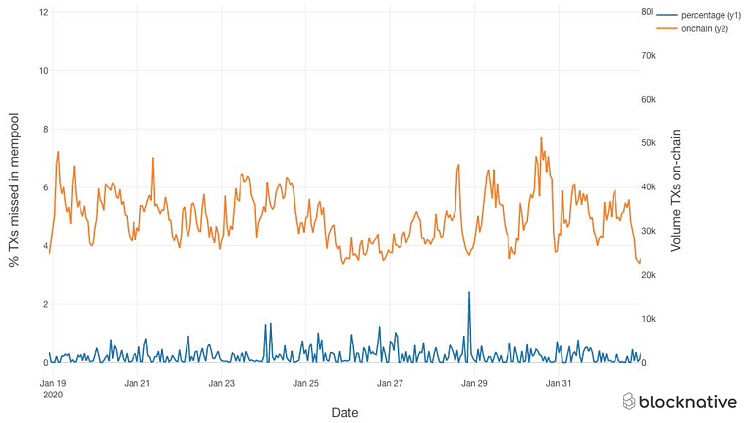

# Exploring different mempool listening methods

Different ways to [listen to incoming mempool txs](https://chainstack.com/exploring-the-methods-of-looking-into-ethereums-transaction-pool/):
- Filters (createFilter + poll it)
- Subscriptions (push model)
- Txpool api (probably useless since keep receiving same txs)
- Graphql api (eip-1767, not thegraph! can subscribe + filter, as opposed to subscribe + querytx + filter locally with subscription model)

None of the free node providers have a graphql endpoint unfortunately. filters and txpools are only for one-off queries, so we will focus on subscriptions.

## ==================== **Subscriptions** ==================
There are 3 levels of subscription:
1. receive all new pending txHashes (all providers, including [alchemy](https://docs.alchemy.com/alchemy/guides/using-websockets#3.-newpendingtransactions))
2. receive all new pending txs (only [alchemy](https://docs.alchemy.com/alchemy/guides/using-websockets#1.-alchemy_newfullpendingtransactions))
3. received filtered pending txs (only [alchemy](https://docs.alchemy.com/alchemy/guides/using-websockets#2.-alchemy_filterednewfullpendingtransactions))
We will go through these one by one
## 1. txHashes only
```
> wscat -c $ALCHEMY_POLYGON_WSS_ENDPOINT
> {"jsonrpc":"2.0","id": 1, "method": "eth_subscribe", "params": ["newPendingTransactions"]}
```
## 2. full txs
```
> wscat -c $ALCHEMY_POLYGON_WSS_ENDPOINT
> {"jsonrpc":"2.0","id": 2, "method": "eth_subscribe", "params": ["alchemy_newFullPendingTransactions"]}
```
## 3. full filtered txs
Here we filter on quickswap's [router](https://polygonscan.com/address/0xa5e0829caced8ffdd4de3c43696c57f7d7a678ff)
```
> wscat -c $ALCHEMY_POLYGON_WSS_ENDPOINT
> {"jsonrpc":"2.0","id": 1, "method": "eth_subscribe", "params": ["alchemy_filteredNewFullPendingTransactions", {"address": "0xa5E0829CaCEd8fFDD4De3c43696c57F7D7A678ff"}]}
```
## We can get the same results in ts using alchemy's [web3 extension](https://docs.alchemy.com/alchemy/documentation/alchemy-web3)
```
import { createAlchemyWeb3 } from "@alch/alchemy-web3";
const web3 = createAlchemyWeb3(process.env.ALCHEMY_POLYGON_WSS_ENDPOINT);
web3.eth.subscribe(
  "pendingTransactions", // or "alchemy_fullPendingTransactions" or "alchemy_filteredFullPendingTransactions"
  async function (error, tx) {
    // do something with tx
  })
```
## ==================== **Benchmarks** ==================

0. setup
```
npm i
export ALCHEMY_WSS_ENDPOINT=...
```

1. run Alchemy fullTxs api benchmark
```
> npx ts-node alchemyFullTxStats.ts
```
This prints summary statistics for how many (what %) of txs received from Alchemy were
- already mined (numTxsAlreadyMined)
- not found when queried a second time (numTxsNotFound)

### RESULTS
```
// POLYGON MAINNET
numTxs: 1377, numTxsAlreadyMined: 340 (24.7%), numTxsNotFound: 484 (35.1%)
numTxs: 5053, numTxsAlreadyMined: 1253 (24.8%), numTxsNotFound: 1968 (38.9%)
// ETHEREUM MAINNET
numTxs: 3750, numTxsAlreadyMined: 0 (0.0%), numTxsNotFound: 2769 (73.8%)
numTxs: 8063, numTxsAlreadyMined: 0 (0.0%), numTxsNotFound: 6172 (76.5%)
```

## FUTURE
It would be nice in the future to also reproduce these 2020 benchmarks:

1. Blocknative's [locally missed mempool txs benchmark](https://www.blocknative.com/blog/8-lesson-master-the-mempool#:~:text=7.%20Mempools%20Miss%20Transactions)



2. Makerdao's [mempool latency benchmark](https://blog.keeperdao.com/a-performance-benchmark-on-mempool-services/#:~:text=address%20of%20interest.-,Performance%20Benchmark,-We%E2%80%99ve%20used%20all)

